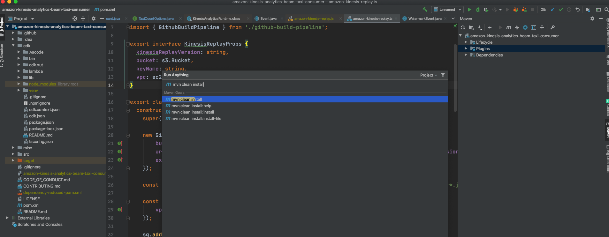
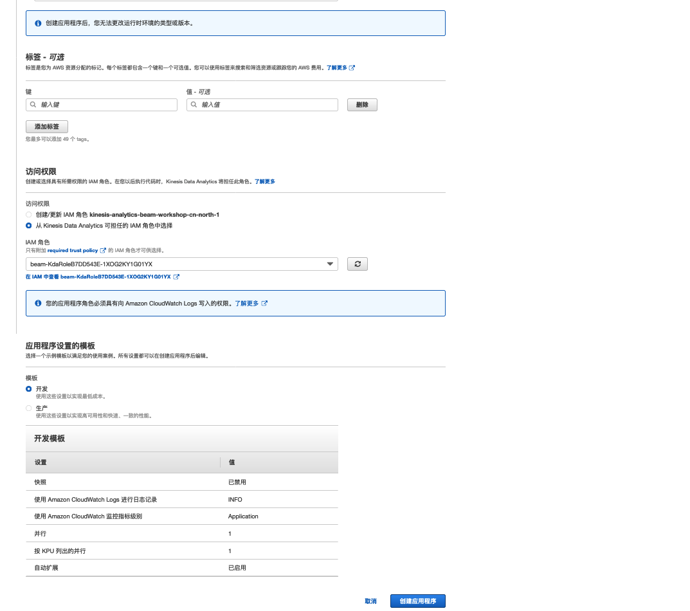
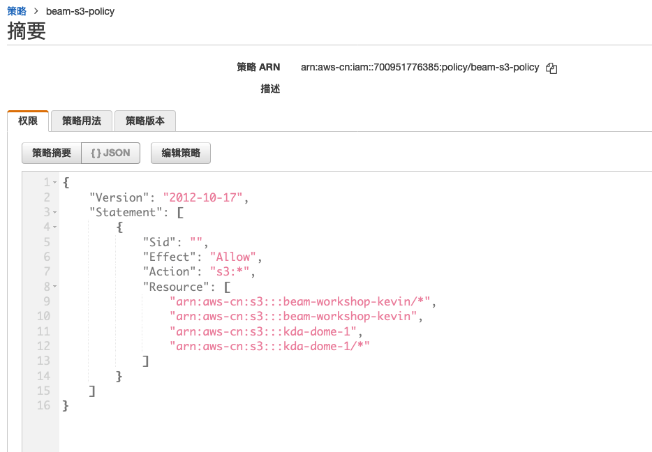
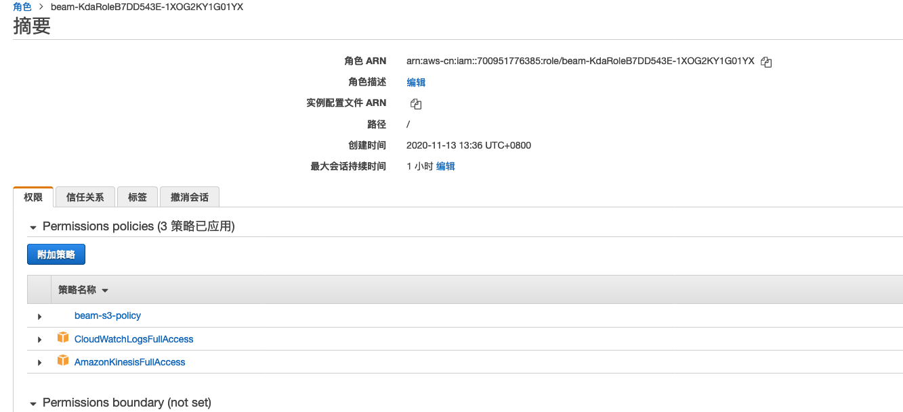
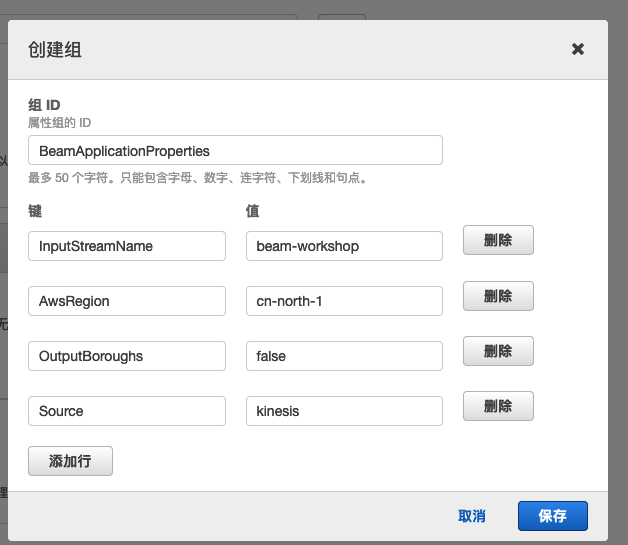
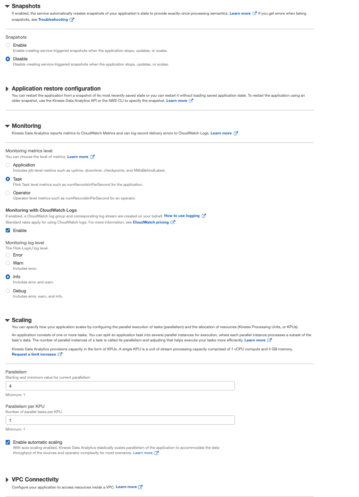

# DEPLOY STREAMING PIPELINE

在本章中，您将Beam管道编译为Jar文件。 Beam管道使用Apache Flink Runner配置，因此可以在托管的Apache Flink环境中使用Kinesis Data Analytics执行该管道。然后，您将创建一个Kinesis Data Analytics应用程序并执行Beam管道，以便它使用特定时间间隔在NYC进行的出租车行程总数填充Amazon CloudWatch仪表板。

一种应用是产生输出，您可以更改Beam管道的输出，以生成有关每个自治市镇出行次数的更细粒度的指标。


#### BUILD BEAM PIPELINE AS JAR

首先，您需要将Flink应用程序及其所有依赖项打包到一个Jar文件中，该文件可以部署到Apache Flink环境中。

1. clone 代码 `git clone https://github.com/jianyew/amazon-kinesis-analytics-beam-taxi-consumer.git`

2. 您可以查看Beam代码的详细信息，以了解在从Kinesis流中读取数据时如何处理数据。

3. 展开Maven窗格，然后单击m以执行干净包作为Maven目标



或者执行 mvn clean install 在项目目录下


4. Maven现在将构建一个jar文件，其中包含Flink应用程序的所有依赖项。 jar文件存储在目标目录中，并且可以部署到Amazon Kinesis Data Analytics。构建完成后，我们可以将该jar文件上传到Amazon S3。在本研讨会中，我们已经为您准备了一个预构建的jar文件。


#### CREATE APPLICATION

您可以在完全托管的Apache Flink环境中使用[Amazon Kinesis Data Analytics](https://console.amazonaws.cn/kinesisanalytics/home?region=cn-north-1#/gettingstarted) 执行Beam管道。 Kinesis Analytics应用程序基本上包括对Amazon S3中Flink应用程序的引用以及一些其他配置数据。创建Kinesis Data Analytics应用程序后，即可在完全托管的环境中由服务部署和执行该应用程序。

1. 导航到[Kinesis Data Analytics Console](https://console.amazonaws.cn/kinesisanalytics/home?region=cn-north-1#/gettingstarted)，然后按创建应用程序
2. 输入`beam-workshop`作为应用程序名称

选择Apache Flink 1.8作为运行时。

从Kinesis Kinesis Analytics可以假定为访问权限的IAM角色中选择“选择”。如果您正在参加AWS托管活动，请选择建议的唯一角色。如果您自己运行研讨会，请选择包含KdaRole的角色。



#### CONFIGURE APPLICATION


创建策略 `beam-s3-policy`

```javascript
{
    "Version": "2012-10-17",
    "Statement": [
        {
            "Sid": "",
            "Effect": "Allow",
             "Action": [
               	"s3:ListBucket",
                "s3:GetBucketLocation",
                "s3:PutObject*",
                "s3:GetObject*",
                "s3:DeleteObject*"
             ],
            "Resource": [
                "arn:aws-cn:s3:::beam-workshop-kevin/*",
                "arn:aws-cn:s3:::beam-workshop-kevin",
                "arn:aws-cn:s3:::kda-dome-1",
                "arn:aws-cn:s3:::kda-dome-1/*"
            ]
        }
      
    ]
}
```







现在已经创建了应用程序的框架。但是您仍然需要调整重要的配置选项，包括Amazon S3上Jar文件的位置，要读取的Kinesis数据流的名称，设置并行性和配置Beam作业参数。

在出现的页面上，按蓝色的Configure（配置）按钮配置Kinesis Data Analytics应用程序。

在Amazon S3存储桶下，选择包含我们之前使用过的历史性旅行的存储桶名称。输入BeamConsumerJarPath作为目标/amazon-kinesis-analytics-beam-taxi-consumer-1.0-SNAPSHOT.jar。


展开“属性”部分，然后选择“创建组”。

在出现的对话框中，选择BeamApplicationProperties作为“组ID”，并添加以下三个键/值对，并单击“保存”进行确认：

InputStreamName带有您先前创建的Kinesis流的名称，即beam-workshop
源将BEAM管道的源IO设置为小写运动
OutputBoroughs设置为false，因为我们不会在流式BEAM管道中生成与自治市镇有关的信息




展开“快照”部分并为应用程序禁用快照


展开监视部分。选择任务作为监视指标级别，然后启用CloudWatch日志记录。选择信息作为监视日志级别


将应用程序的并行度设置为4。这将确定Kinesis Data Analytics中用于该应用程序的缩放因子。将每个KPU的并行度保留为默认值1。





