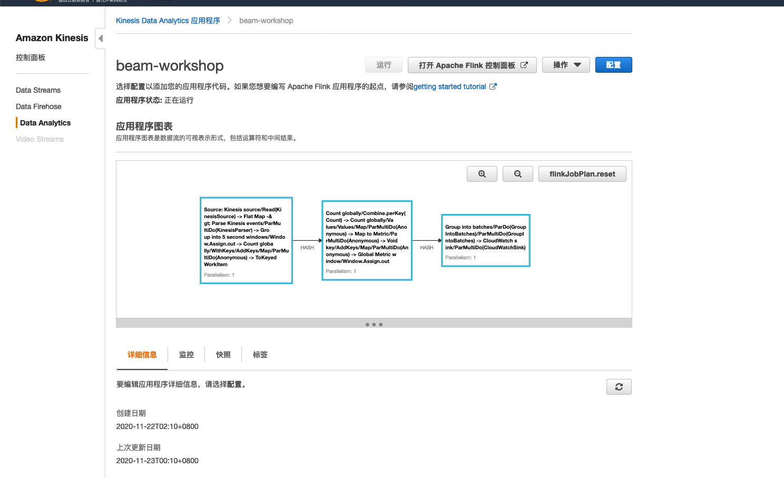

# START APPLICATION

该应用程序终于可以在完全托管的Flink环境中通过Kinesis Data Analytics服务执行了。现在，您可以开始执行并将事件发送到Kinesis数据流中。然后，Flink应用程序将连续处理提取到数据流中的数据，并将派生的见解发送到Amazon CloudWatch以进行可视化。


1. 更新完成后，在结果页面上按“运行”，然后再次选择“运行”以确认要运行该应用程序。现在，该应用程序将在后台启动，这可能需要几分钟。运行后，您可以检查Flink应用程序的操作员图。



*如果在Kinesis数据分析应用程序运行后没有看到对象图，请在浏览器中单击“刷新”。您可以通过检查通过Amazon CloudWatch公开的应用程序日志来进一步调试应用程序。*


2. 在ec2上运行

``` shell
java -jar amazon-kinesis-replay-1.0-SNAPSHOT.jar -streamRegion cn-north-1 -streamName beam-workshop -bucketRegion cn-north-1 -objectPrefix artifacts/kinesis-analytics-taxi-consumer/taxi-trips-partitioned.json.lz4/dropoff_year=2018/ -speedup 720
```


3.查看cloudwatch

//todo：：