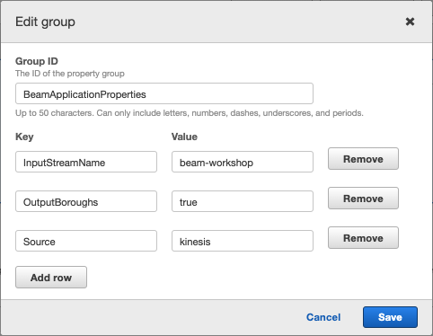
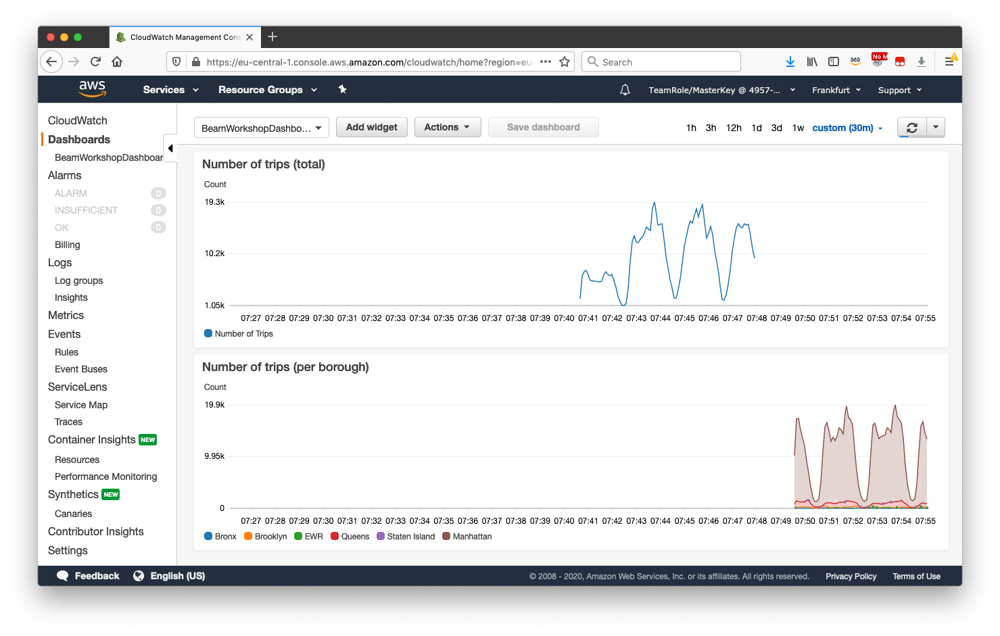

# UPDATE APPLICATION PARAMETERS

1.返回Kinesis Data Analytics应用程序并更新配置。选择**配置**，然后向下滚动至您之前创建的**属性**部分。为组“ BeamApplicationProperties”选择“编辑组”。

将属性OutputBoroughs更新为true。选择**更新**，然后等待几分钟以更新操作员图。

2. Go back to the [CloudWatch dashboard](https://console.aws.amazon.com/cloudwatch/), and hit refresh in top right. In the bottom graph you should start seeing trips that are counted per borough, similar to this. It appears for this data set the borough of Manhattan has the most trips!

